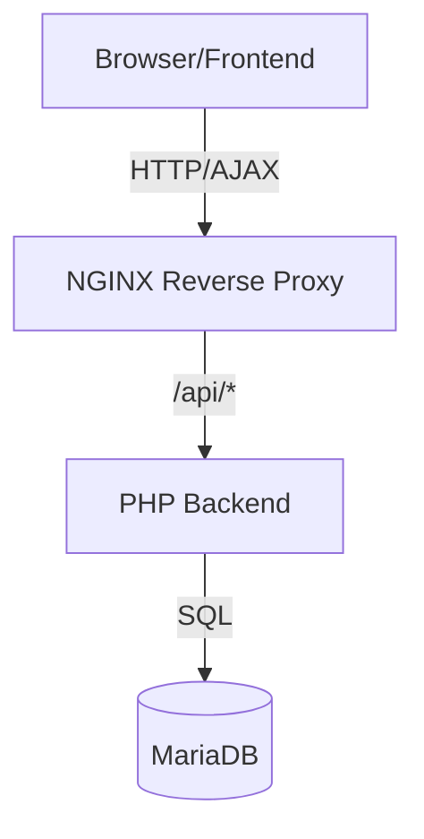

# Technische Dokumentation - Webanwendung "storeanumber"

## Inhaltsverzeichnis

1. Systemarchitektur
2. Frontend
3. Backend
4. Datenbank
5. Installation

## Systemarchitektur

Die Anwendung verwendet eine moderne 3-Tier-Architektur:



### Technologie-Stack

- **Frontend**: Vue.js 3 + Vite
- **Backend**: PHP 8.2 + Apache
- **Datenbank**: MariaDB
- **Proxy**: NGINX
- **Container**: Docker + Docker Compose

## Frontend

Das Frontend basiert auf Vue.js 3 und verwendet folgende Hauptkomponenten:

-

App.vue

: Root-Komponente

-

LoginForm.vue

: Authentifizierung

-

NumberDisplay.vue

: Hauptfunktionalität

Der State wird zentral mit Vuex verwaltet:

```js
const store = createStore({
  state: {
    user: null,
    number: null,
  },
  mutations: {
    setUser: (state, user) => (state.user = user),
    setNumber: (state, number) => (state.number = number),
  },
});
```

## Backend

Das PHP-Backend implementiert eine REST-API mit folgenden Endpunkten:

| Endpunkt          | Methode | Funktion          |
| ----------------- | ------- | ----------------- |
| `/api/login`      | POST    | Benutzeranmeldung |
| `/api/register`   | POST    | Registrierung     |
| `/api/getNumber`  | GET     | Nummer abrufen    |
| `/api/saveNumber` | POST    | Nummer speichern  |

Die

MessageHandler

Klasse generiert humorvolle Nachrichten basierend auf der gespeicherten Nummer.

## Datenbank

Das Datenbankschema wird in

init.sql

definiert:

```sql
CREATE TABLE users (
    id INT AUTO_INCREMENT PRIMARY KEY,
    username VARCHAR(255) NOT NULL UNIQUE,
    password VARCHAR(255),
    number INT DEFAULT NULL,
    created_at TIMESTAMP DEFAULT CURRENT_TIMESTAMP
);
```

## Installation

1. Klonen des Repositories:

```bash
git clone <repository-url>
```

2. Umgebungsvariablen konfigurieren in

.env

:

```
DB_NAME=numberdb
DB_USER=appuser
DB_PASSWORD=userpassword
DB_HOST=db
```

3. Container starten:

```bash
docker-compose up -d
```

Die Anwendung ist dann unter http://localhost:8080 erreichbar.
