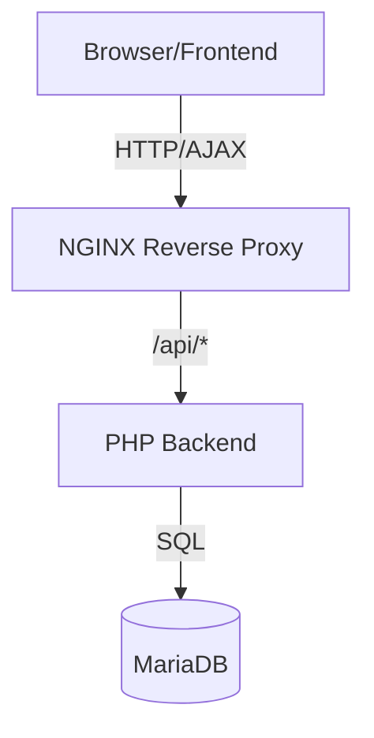

# Dokumentation "storeanumber"
*Paul Klemm*  
*ON23-3, November 2024*

## Inhaltsverzeichnis
1. [Thema des Projekts](#1-thema-des-projekts)
2. [Ausgangssituation](#2-ausgangssituation)
3. [Vorgehen](#3-vorgehen)
4. [Anforderungsliste](#4-anforderungsliste)
5. [Konzeption](#5-konzeption)
   - [5.1. Technologie-/Werkzeugauswahl](#51-technologie-werkzeugauswahl)
   - [5.2. Entwurf](#52-entwurf)
6. [Ergebnis des Projekts](#6-ergebnis-des-projekts)
7. [Reflexion](#7-reflexion)
   - [7.1. Herausforderungen](#71-herausforderungen)
   - [7.2. Unterstützung](#72-unterstützung)
   - [7.3. Lernerfolge / Fazit](#73-lernerfolge--fazit)
- [A. Installationsanleitung](#a-installationsanleitung)
- [B. Benutzerdokumentation](#b-benutzerdokumentation)

## 1. Thema des Projekts

Themenwahl:

Für mein erstes Fullstack-Projekt möchte ich mich zunächst mit den Grundlagen vertraut machen und mein Projekt eventuell erweitern, wenn die Zeit es zulässt.

Ich habe die Domain storeanumber.com gefunden, die noch frei ist, daher meine Grundidee, eine Webseite zu entwickeln, die es jedem User ermöglicht, einen Account zu erstellen und eine Nummer zu speichern. Das als Scherzprojekt online zu stellen wäre sehr lustig und man könnte auch noch Eastereggs einbauen, z.B. lustige Nachrichtentexte über die gewählte Zahl.

## 2. Ausgangssituation

Ich habe bisher kaum mich mit Webentwicklung beschäftigt. Meine Erfahrung stammt vor allem aus den verschiedenen Vorlesungen der vorangegangenen Semester und den dort erstellten Projekten. Ich habe bereits Erfahrungen mit dem Hosting von Open Source Projekten zuhause auf einem Raspberry Pi gemacht und wollte daher meine Web Anwendung möglichst portable gestalten, um diese auf jedem System einfach zu deployen zu können.

## 3. Vorgehen

Das Projekt wurde als erste Fullstack-Webanwendung konzipiert, mit Fokus auf:

- Moderne Entwicklungspraktiken
- Container-basierte Entwicklung und Deployment
- Klare Trennung von Frontend und Backend
- Sichere Benutzerauthentifizierung
- Skalierbare und wartbare Architektur

## 4. Anforderungsliste

| Anforderung | Status | Begründung |
|-------------|---------|------------|
| Containerisierte Architektur | ✅ | Portable Deployment |
| Frontend/Backend Trennung | ✅ | Bessere Wartbarkeit |
| Benutzerauthentifizierung | ✅ | Sicherheit & Personalisierung |
| REST API | ✅ | Standardisierte Kommunikation |
| Responsive UI | ✅ | Benutzerfreundlichkeit |

## 5. Konzeption

### 5.1. Technologie-/Werkzeugauswahl

#### Frontend
- **Vue.js 3:**
  - Reaktives UI-Framework
  - Composition API für bessere Code-Organisation
  - Kleine Lernkurve
  - Gute Dokumentation

- **Vuex:**
  - Zentrales State Management
  - Vorhersehbarer Datenzustand
  - Einfache Integration mit Vue.js

- **Axios:**
  - Promise-basierte HTTP-Requests
  - Gute Browser-Kompatibilität
  - Interceptor-Unterstützung

#### Backend
- **PHP 8.2:**
  - Einfache Setup
  - Gute Performance
  - Breite Hosting-Verfügbarkeit

- **MariaDB:**
  - Open Source
  - MySQL-kompatibel
  - Zuverlässig und schnell

### 5.2. Entwurf

#### Architektur
Die Anwendung verwendet eine moderne 3-Tier-Architektur:


#### Hauptkomponenten

**Frontend (frontend/src/App.vue)**
- Zentrale App-Komponente
- Routing zwischen Login und Hauptansicht
- Vuex State Management

**Backend (backend/src/Database.php)**
- REST API mit PHP
- Session-Management
- MariaDB-Anbindung

**Datenbank (database/init.sql)**
- Users Tabelle für Authentifizierung
- Speicherung der Nutzerdaten

#### CRUD-Zyklus

**Create/Update:**
```javascript
// Frontend (store.actions)
saveNumber: async ({ commit }, number) => {
  await axios.post('/api/saveNumber', { number });
  commit('setNumber', number);
}
```

**Read:**
```javascript
// Frontend (store.actions)
getNumber: async ({ commit }) => {
  const { data } = await axios.get('/api/getNumber');
  commit('setNumber', data.number);
}
```

**Backend Handling:**
```php
// Backend (API Endpoint)
case '/getNumber':
  require_once '../src/api/getNumber.php';
  break;
```

#### API-Schnittstellen

| Endpoint | Methode | Funktion |
|----------|---------|-----------|
| /api/login | POST | Authentifizierung |
| /api/register | POST | Benutzerregistrierung |
| /api/getNumber | GET | Nummer abrufen |
| /api/saveNumber | POST | Nummer speichern |

#### UI-Entwurf

Die Benutzeroberfläche wurde mit Vue.js und der Options API gestaltet, um eine reaktive und benutzerfreundliche Erfahrung zu bieten. Die Hauptkomponenten sind:
- App.vue: Root-Komponente
- LoginForm.vue: Authentifizierung
- NumberDisplay.vue: Hauptfunktionalität

Der State wird zentral mit Vuex verwaltet:
```javascript
const store = createStore({
  state: {
    user: null, // Angemeldeter Benutzer
    number: null // Gespeicherte Nummer
  }
})
```

#### Datenmodell

Das Datenbankschema wurde in einer separaten Datei definiert und in einem Docker-Volume gespeichert:

```sql
CREATE TABLE users (
  id INT AUTO_INCREMENT PRIMARY KEY,
  username VARCHAR(255) NOT NULL UNIQUE,
  password VARCHAR(255),
  number INT DEFAULT NULL
);
```

#### Sicherheitsaspekte
- Passwörter werden mit PHP's password_hash() verschlüsselt
- Prepared Statements gegen SQL-Injection
- CORS-Konfiguration in Apache/NGINX
- Session-Management mit sicheren Cookies

## 6. Ergebnis des Projekts

Das Ergebnis des Projekts ist eine funktionale Webanwendung, die es Nutzern ermöglicht, sich zu registrieren, anzumelden und eine Nummer zu speichern.

Das Projekt demonstriert erfolgreich:
1. Moderne Fullstack-Entwicklung
2. Container-basierte Architektur
3. Sichere Benutzerauthentifizierung
4. REST API-Design
5. State Management
6. Responsive UI

Die Anwendung ist durch die Docker-Containerisierung leicht zu deployen und zu skalieren.

## 7. Reflexion

### 7.1 Herausforderungen

Eine der größten Herausforderungen war die sichere Implementierung der Benutzerauthentifizierung und die Integration der verschiedenen Technologien.

Vor allem das Umsetzen in drei Containern wurde sehr komplex, da die Anwendung als API aufgebaut werden musste. Auch das Debugging war schwieriger durch die Arbeit mit Logdateien in den Containern. Durch kontinuierliches Lernen und Experimentieren konnten diese Herausforderungen jedoch gemeistert werden.

### 7.2. Unterstützung

Hauptsächlich wurden KI Tools zur Unterstützung genutzt, konkret der Github Copilot, ChatGPT und Claude. Bei Problemen, die nicht durch KI gelöst werden konnten, wurde auf Online-Ressourcen wie Dokumentationen und Foren zurückgegriffen.

### 7.3. Lernerfolge / Fazit

Es wurden viele Erkenntnisse über moderne Webentwicklung, Containerisierung und die Integration von Frontend und Backend gewonnen. Dieses Wissen wird in zukünftigen Projekten anwendbar sein. Das Ergebnis ist zufriedenstellend und bietet Potenzial für weitere Verbesserungen und Erweiterungen.

## A. Installationsanleitung

1. **Repository klonen:**
```bash
git clone https://github.com/someonesocial/storeanumber
```

2. **(Optional) Umgebungsvariablen konfigurieren in .env:**
```
DB_NAME=numberdb
DB_USER=appuser
DB_PASSWORD=userpassword
DB_HOST=db
```

3. **Container starten:**
```bash
cd storeanumber
docker-compose up -d --build
```

Die Anwendung ist dann unter http://localhost:8080 erreichbar.

## B. Benutzerdokumentation

### Aufgaben

1. **Registrierung**: Nutzer können sich registrieren, um einen Account zu erstellen.
2. **Anmeldung**: Nach der Registrierung können sich Nutzer anmelden.
3. **Nummer speichern**: Angemeldete Nutzer können eine Nummer speichern und erhalten eine humorvolle Nachricht.
4. **Abmeldung**: Angemeldete Nutzer können sich abmelden.

### Benutzerszenarien

1. Registrierung:

2. Anmeldung:

3. Nummer speichern:

4. Nummer ändern:

